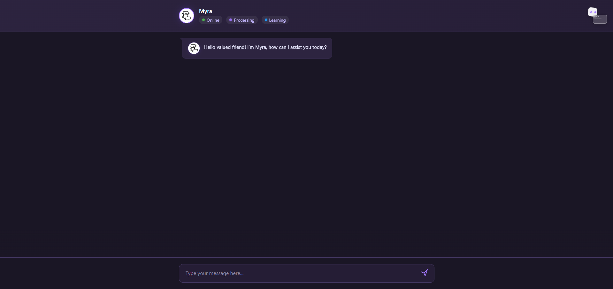
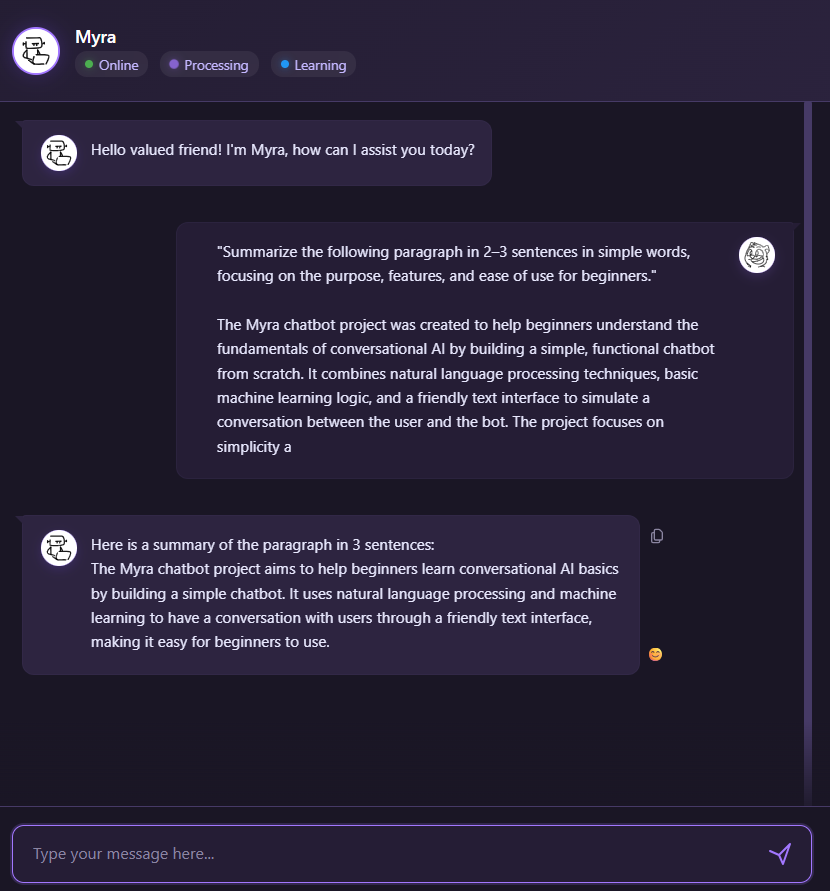

# MyraChatBot - AI Assistant Powered by Groq API

## Overview

MyraChatBot is a modern, responsive AI assistant web application built with FastAPI that leverages the power of Groq's large language models to provide intelligent conversation, text summarization, and scenario description capabilities. The application features a sleek web interface that makes interacting with AI models intuitive and seamless.

<div align="center">
  
</div>

## Screenshots

### Chat Interface


*The main chat interface where users can interact with the AI assistant*

### Text Summarization


*Text summarization feature in action*

### Mobile View


*The mobile interface provides a seamless chat experience on smaller screens*

## Features

- **AI-Powered Chat**: Have natural conversations with advanced AI models (Llama3-70B or Mixtral-8x7B)
- **Text Summarization**: Generate concise summaries of any text input
- **Visual Scenario Description**: Generate natural language descriptions from object detection data
- **User-Friendly Interface**: Modern, responsive UI with code highlighting and markdown support
- **Configurable Settings**: Easily customizable through environment variables

## Tech Stack

- **Backend**: FastAPI (Python)
- **AI Provider**: Groq API (supports multiple LLM models)
- **Frontend**: HTML/CSS/JavaScript
- **Containerization**: Virtual environment management
- **Syntax Highlighting**: Prism.js for code blocks

## Project Structure

```
MyraChatBot/
│
├── api/                  # API module
│   ├── __init__.py
│   ├── main.py           # FastAPI application entry point
│   └── routes.py         # API router configuration
│
├── audio/                # Directory for audio files
│
├── config/               # Configuration module
│   ├── settings.py       # Application settings
│   └── voice_mapping.py  # Voice configuration
│
├── core/                 # Core functionality
│   └── chat.py           # ChatManager implementation
│
├── logs/                 # Log files
│   └── app.log
│
├── myra-bot/             # Virtual environment
│
├── routes/               # API route implementations
│   └── chat_routes.py    # Chat-related endpoints
│
├── static/               # Static files
│   ├── favicon.ico
│   ├── profile-photo.jpg
│   ├── resume.pdf
│   └── SVG/              # SVG assets
│      ├── bot.svg
│      └── user.svg
│
└── templates/            # HTML templates
    └── bot.html          # Main UI template
```

## API Endpoints

| Endpoint       | Method | Description                                      |
| -------------- | ------ | ------------------------------------------------ |
| `/`          | GET    | Serves the main chat interface                   |
| `/chat`      | POST   | Process chat requests                            |
| `/summarize` | POST   | Generate text summaries                          |
| `/scenario`  | POST   | Generate descriptions from object detection data |

## Setup and Installation

### Prerequisites

- Python 3.9+
- [Groq API key](https://console.groq.com)
- Modern web browser

### Environment Setup

1. Clone the repository:

   ```
   git clone <repository-url>
   cd MyraChatBot
   ```
2. Create and activate a virtual environment:

   ```
   python -m venv myra-bot
   myra-bot\Scripts\activate
   ```
3. Install dependencies:

   ```
   pip install fastapi uvicorn groq python-dotenv
   ```
4. Create a `.env` file in the root directory:

   ```
   Username=YourUsername
   Assistantname=Myra
   GroqAPIKey=your_groq_api_key_here
   ```

### Running the Application

1. Start the server:

   ```
   uvicorn api.main:create_app --host 0.0.0.0 --port 8000 --reload
   ```
2. Open your browser and navigate to:

   ```
   http://localhost:8000
   ```

## Usage Examples

### Chat Interaction

Send a POST request to `/chat` with:

```json
{
  "query": "What is the capital of France?",
  "userName": "User"
}
```

### Text Summarization

Send a POST request to `/summarize` with:

```json
{
  "text": "Lorem ipsum dolor sit amet, consectetur adipiscing elit. Sed do eiusmod tempor incididunt ut labore et dolore magna aliqua. Ut enim ad minim veniam, quis nostrud exercitation ullamco laboris nisi ut aliquip ex ea commodo consequat."
}
```

### Scenario Description

Send a POST request to `/scenario` with:

```json
{
  "status": "success",
  "filename": "image.jpg",
  "detections": {
    "person": [
      {
        "object_id": "person_1",
        "position": "center",
        "confidence": 0.95
      }
    ],
    "dog": [
      {
        "object_id": "dog_1",
        "position": "bottom-right",
        "confidence": 0.87
      }
    ]
  }
}
```

## Configuration Options

The application can be configured through the `.env` file:

- `Username`: Default username for interactions
- `Assistantname`: Name of the AI assistant
- `GroqAPIKey`: Your Groq API key for accessing LLM models

## Logging

Logs are stored in `logs/app.log` and include:

- API request/response details
- Error information
- System messages

## Error Handling

The application includes comprehensive error handling for:

- API connection issues
- Empty or invalid inputs
- Model availability problems
- Configuration errors

## Contributing

1. Fork the repository
2. Create a feature branch
3. Commit your changes
4. Push to the branch
5. Open a pull request

### Adding Screenshots

To add screenshots to the README:

1. Take screenshots of the application showing various features
2. Save the screenshots in the `screenshots` directory with descriptive names
3. Update the image paths in the README if necessary
4. Make sure screenshots are clear and demonstrate the feature effectively

## License

This project is licensed under the MIT License - see the LICENSE file for details.

## Acknowledgements

- [FastAPI](https://fastapi.tiangolo.com/) - The web framework used
- [Groq](https://console.groq.com) - AI provider
- [Prism.js](https://prismjs.com/) - Syntax highlighting

# Myra ChatBot

A FastAPI-based chatbot powered by Groq AI, offering intelligent conversation, text summarization, and visual scene description capabilities.

## Features

- 💬 AI-powered chat interface using Groq's advanced language models
- 📝 Text summarization for condensing long content
- 🖼️ Visual scene description for accessibility
- ⚡ Fast, responsive API built with FastAPI
- 📱 Mobile-friendly interface that adapts to all device sizes

## Screenshots

The application features a clean, intuitive interface that works across devices:

- **Desktop Interface**: Full-featured chat experience with ample space for conversations
- **Mobile View**: Responsive design that adapts to smaller screens while maintaining all functionality

  
  *The mobile interface provides a seamless chat experience on smaller screens*

More screenshots can be found in the [screenshots directory](screenshots/).

## Setup

### Prerequisites

- Python 3.9 or higher
- Groq API key (get one at [https://console.groq.com](https://console.groq.com))

### Environment Variables

Create a `.env` file in the project root with:

```
GroqAPIKey=your_api_key_here
Username=YourUsername
Assistantname=Myra
```

### Installation

1. Clone this repository:

   ```
   git clone https://github.com/yourusername/MyraChatBot.git
   cd MyraChatBot
   ```
2. Install dependencies:

   ```
   pip install -r requirements.txt
   ```
3. Run locally:

   ```
   uvicorn api.main:app --reload
   ```
4. Visit `http://localhost:8000` in your browser

## API Endpoints

- `POST /chat` - Send messages to the chatbot
- `POST /summarize` - Generate concise summaries of text
- `POST /scenario` - Create descriptions based on detected objects in images

## Deployment

### GitHub

```bash
git init
git add .
git commit -m "Initial commit"
git branch -M main
git remote add origin https://github.com/yourusername/MyraChatBot.git
git push -u origin main
```

### Vercel

1. Import your GitHub repository in Vercel
2. Add your environment variables in Vercel's project settings
3. Deploy with default settings

## Mobile Responsive Design

MyraChatBot features a fully responsive design that works seamlessly across devices:

- **Adaptive Layout**: Interface elements resize and reposition based on screen size
- **Touch-Friendly Controls**: Larger hit areas on mobile for better usability
- **Consistent Experience**: All features available regardless of device
- **Performance Optimized**: Fast loading even on slower mobile connections

The mobile interface maintains the same powerful functionality as the desktop version while adapting to the constraints of smaller screens. See the [mobile view screenshot](screenshots/mobile-view.png) for a preview.

## License

MIT
